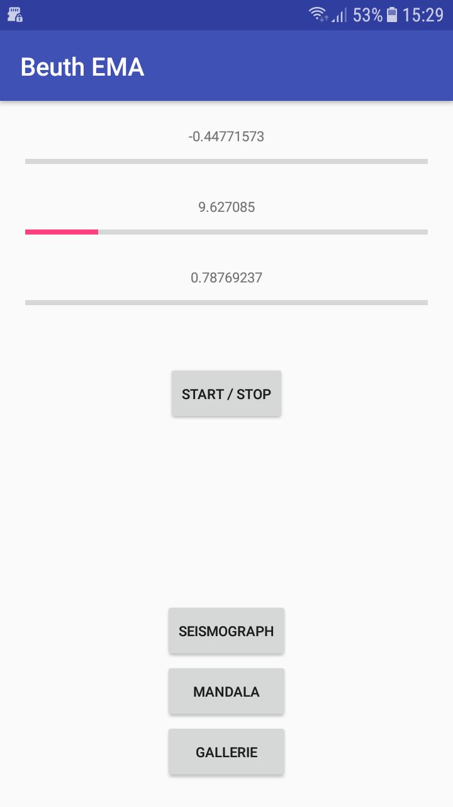
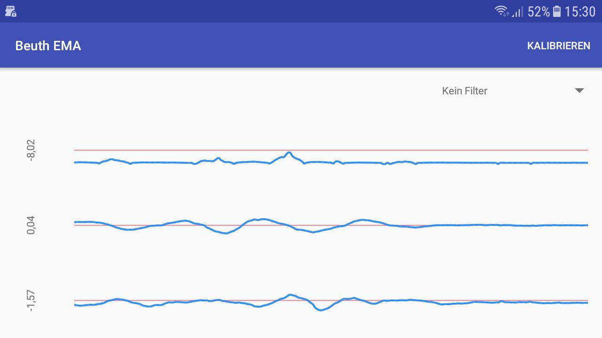
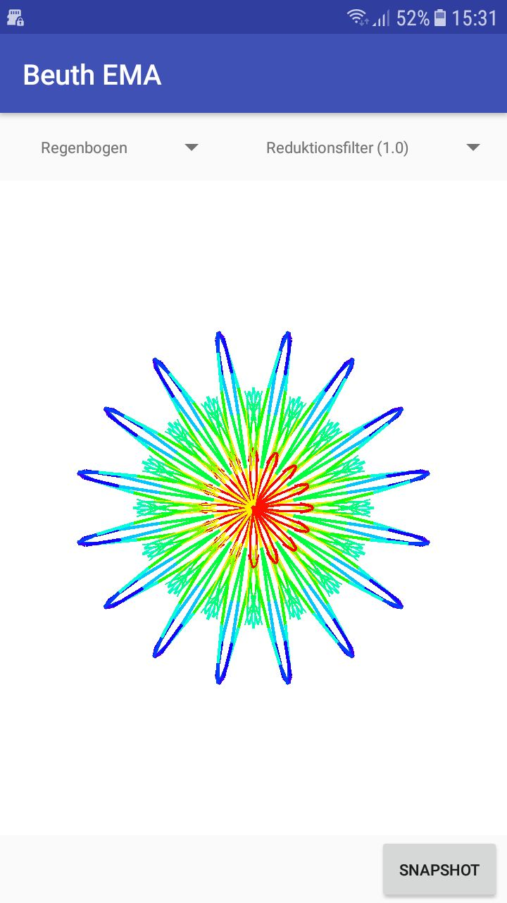
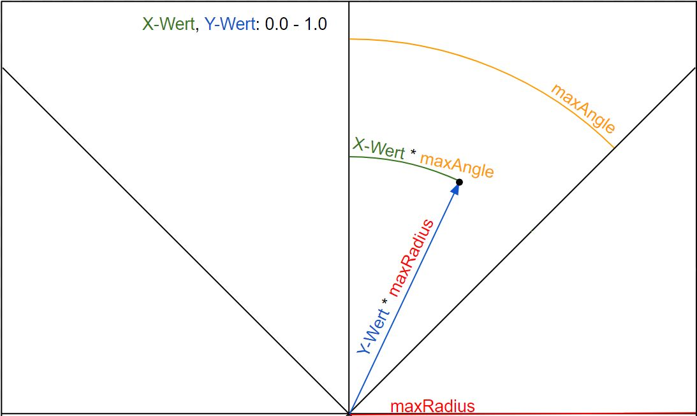
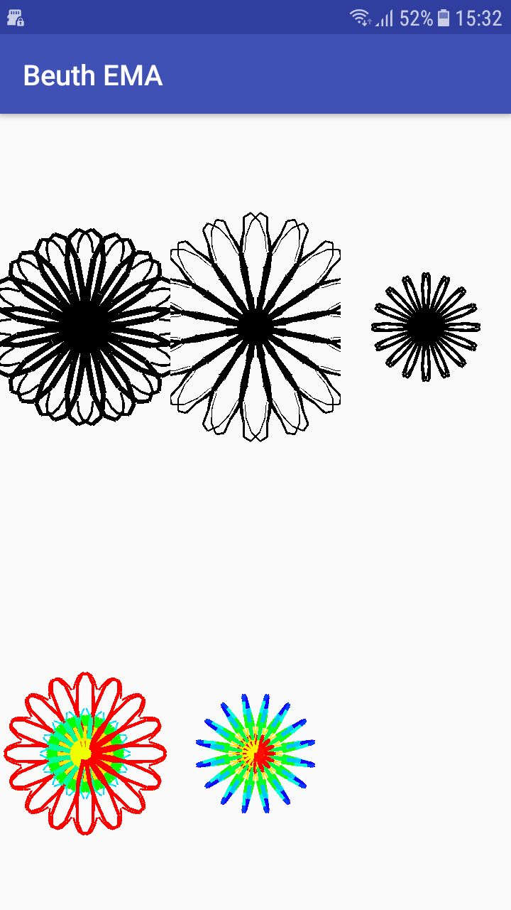
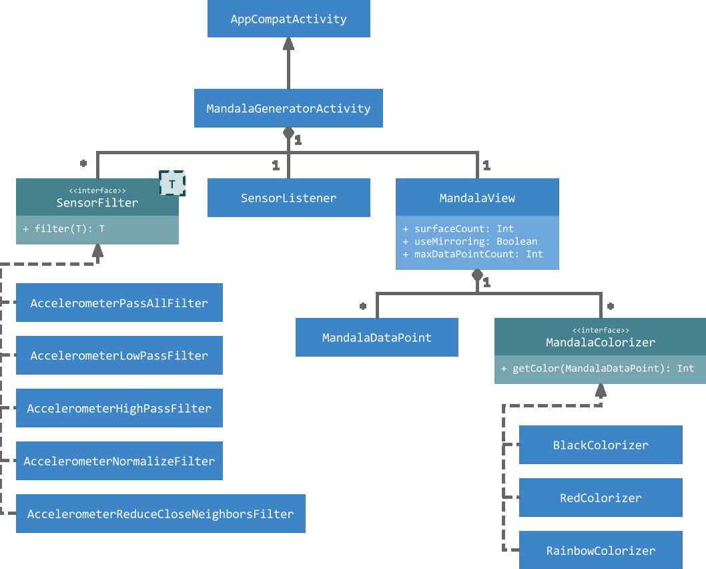
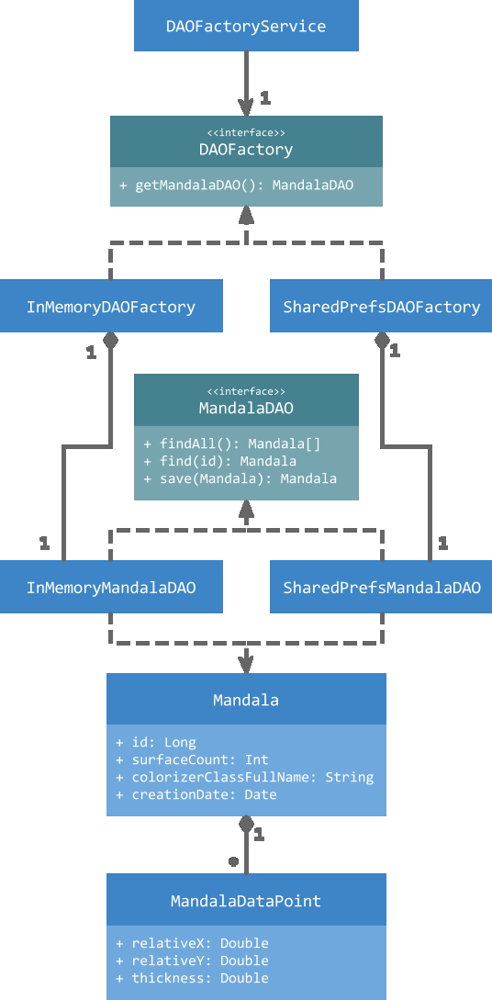

# Sensor Mandala

This Android app is a university project demonstrating the use of sensor data generated by a phone's accelerometer. To achieve that, it presents received data either as a seismograph-like chart or as a generated piece of art, called mandala.

## Menu

Launching the app brings the user to the menu view first. At the top the phone's current acceleration is displayed in 3 progress bars, one for each axis. At the bottom there are buttons to navigate to the other views of the app.

## Seismograph

The seismograph-like chart displays the phone's acceleration in all 3 axes. It is refreshed at a regular interval and shows data changes over a few seconds. It makes use of [MPAndroidChart's](https://github.com/PhilJay/MPAndroidChart) LineChart component.

## Mandala Generator

The mandala generator uses the sensor data generated by the phones accelerometer as input to generate its visuals. Each mandala consists of multiple segments whereas each second segment is a mirror to the one before. It takes the sensor data points over a certain amount of time and maps them to coordinates inside each segment. All coordinates are connected using lines on a canvas. The result looks like the following:

Moving and shaking the phone generates data points which change the appearance of the mandala. A snapshot of the current mandala state can be taken at any time by the press of a button.

### Calculation

The calculation of a coordinate by a data point is shown in the following listing. The acceleration on the x-axis of each data point is translated to an angle offset in each segment. The y-axis is mapped to the distance from the mandala center. The z-axis is only used for the thickness of the lines between coordinates.

### Filters

The generator offers filters that can be applied to modify the collection of data points that are used for drawing. High-pass and low-pass filters for example ignore data points that are higher or lower a specific threshold. The `ReduceCloseNeighbors` filter ignores data points that have a low delta to their predecessor. This improves rendering performance by leaving out very short lines that are hardly visible anyways.

### Color

The generator offers different coloring options called `Colorizers`. Each implementation of a colorizer determines a color for each data point. Currently, black, red and rainbow coloring is supported.

## Mandala Gallery

Mandala snapshots can be viewed in the gallery. Tapping a mandala shows it in full screen size.

## App Architecture

### UML class diagram of `MandalaGeneratorActivity` and associated components

### UML class diagram of data layer

